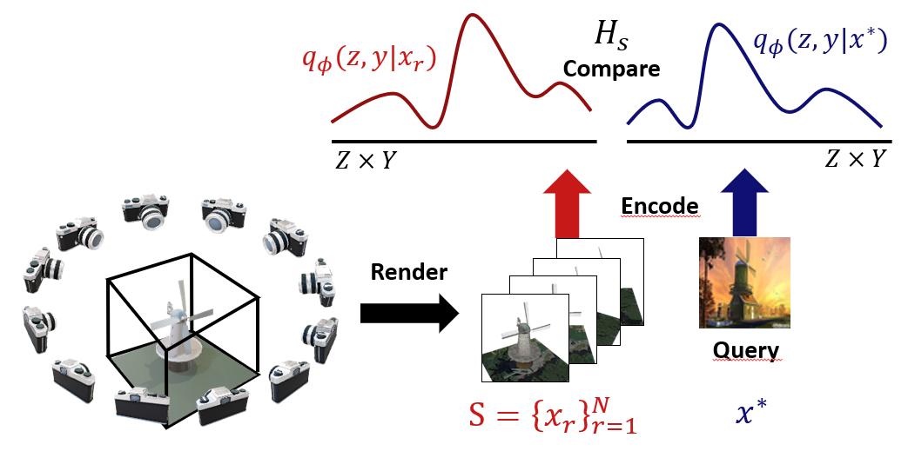

# SHREC (SHape REtrieval Competition) Image Based 3D Scene Retrieval with Conditional Variational Autoencoders  
This repository includes the code submitted for the [SHape REtrieval Competition of 2019](http://orca.st.usm.edu/~bli/SceneIBR2019/) on image based 3D scene retrieval. The main task of the competition was to create a model capable of retrieving the most relevant 3D scenes based on an image query. Relevant scenes are such that share the same class type with the query image.
 

VGG weights pretrained on the [Places](http://places2.csail.mit.edu/) dataset were obtained from 
by [Kalliatakis G.](https://github.com/GKalliatakis/Keras-VGG16-places365). 


#### Rendering
The method works with rendered images from the sketchup models.
The renders are generated from the Ruby scripts within the rendering folder. The scripts need to be run in the SketchUp Ruby terminal. 

In order to use Sketchup (only for NON-COMERCIAL use) for free to render the data you can download SketchUp Make 2017 in the link bellow:
https://help.sketchup.com/en/downloading-older-versions

In Sketchup Make go to the Window menu and select Ruby Console. In the console type the command: 

```
load "PATH_TO_RENDERING_FOLDER/render_rotations.rb"
```
There are two rendering files available:

- render_rotations.rb : This file allows to render several views (256x256x3 pixel images) from all of the sketchup files models within a folder and save the created images in a target folder. The script will open a directory box to select the folder that contains the .skp files and will open a second directory box to select the target directory to save the created images. The views are obtained from 13 different positions, 12 are around the 3D scene by rotating the camera by equidistant angles with respect to the center of the scene and the extra view is from the predefined orientations from the dataset. 

#### Dataset
In the dataset folder folder the data from the [SHREC competition](http://orca.st.usm.edu/~bli/SceneIBR2019/) needs to be added. The generated renders obtained by using the rendering codes should be placed in render_256 and test_render_256 respectively. On the other hand, the data corresponding to the query images, both for training and test need to be placed at the train_photographs and test_photographs folder respectively.   


#### Notebooks


The order for running the notebooks is as follows
1. resize_images: The rendering process produces images with size (256x256x3) which can be used to train the vgg_cvae model. For the training of a simple_cvae model we need to use resized images of size (64x64x3). This notebook processes the data that has been placed in the corresponding folder to generate the resized data for training and evaluation. It also fixes some of the images from the given image dataset of SHREC since some of the pictures cannot be loaded. 
2. train_simple_cvae or train_vgg_cvae: These notebooks are used for training the corresponding models. The obtained trained models are stored in the training_models folder.
3. make_submissions_simple or make_submissions_vgg: These notebooks are used for evaluating the trained models which have been placed in the trained_models folder after training. The submission files are placed in the submissions folder  



#### References

- Reference to Places dataset
 
Places: A 10 million Image Database for Scene Recognition
Zhou, B., Lapedriza, A., Khosla, A., Oliva, A., & Torralba, A.
IEEE Transactions on Pattern Analysis and Machine Intelligence
- Reference to Kalliatakis repository:

@misc{gkallia2017keras_places365,
title={Keras-VGG16-Places365},
author={Grigorios Kalliatakis},
year={2017},
publisher={GitHub},
howpublished={\url{https://github.com/GKalliatakis/Keras-VGG16-places365}},
}

